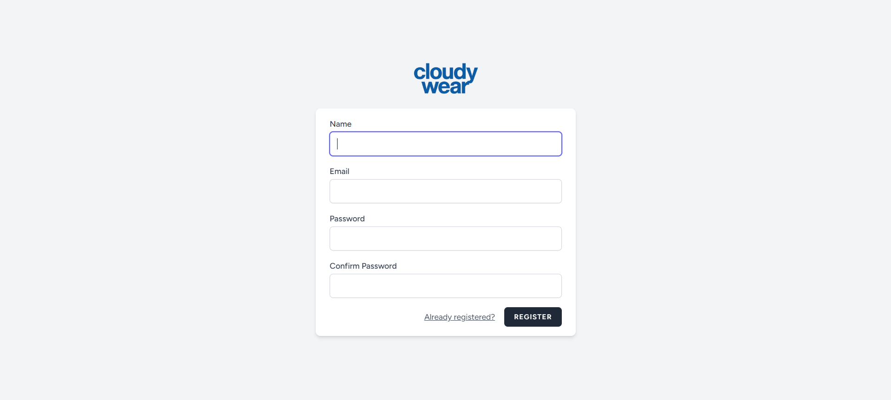
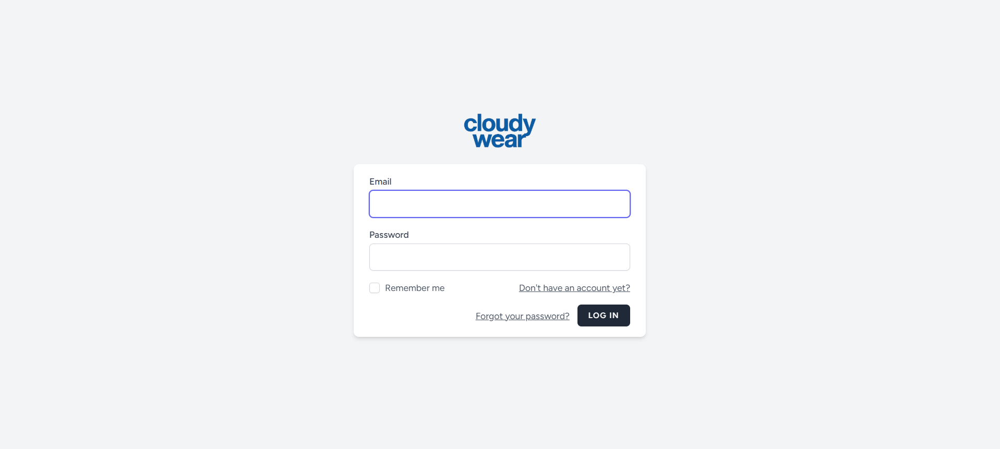
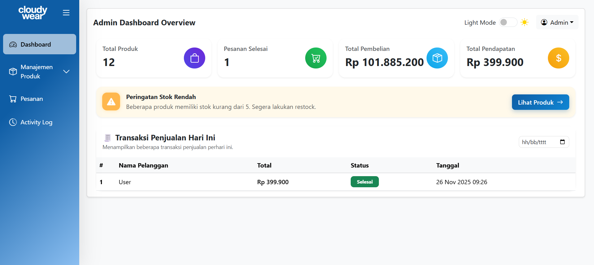
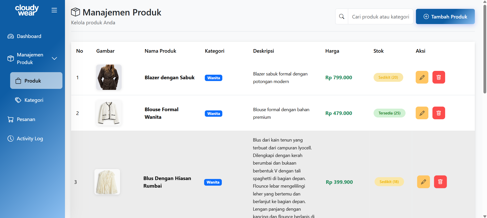
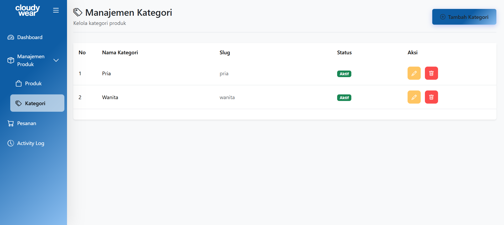
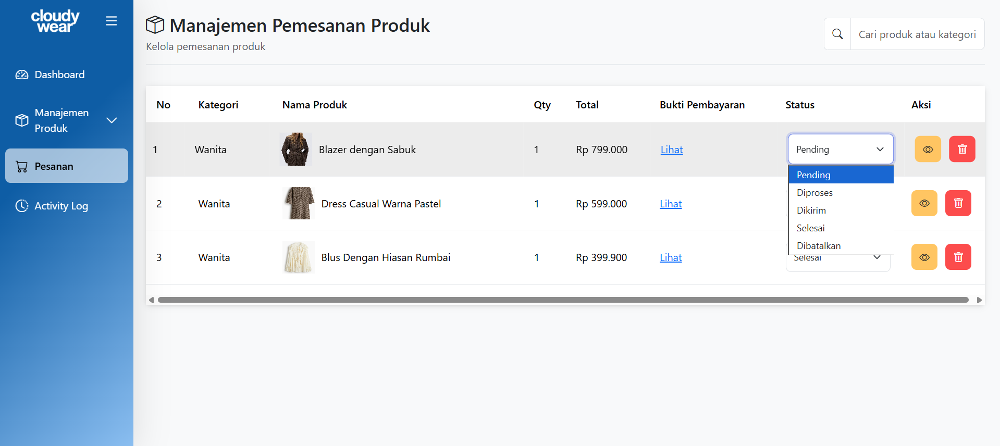
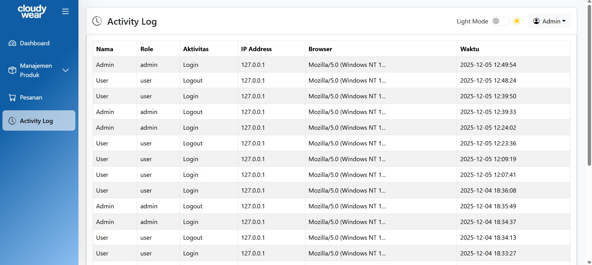
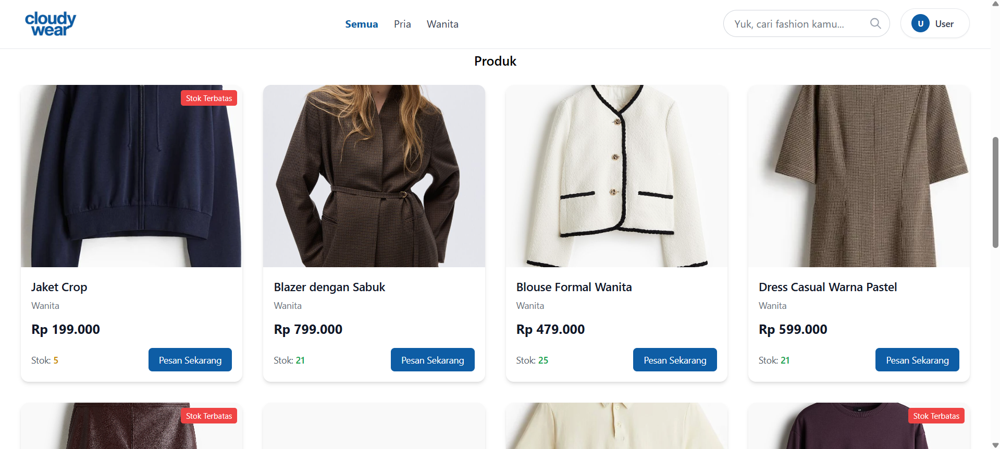
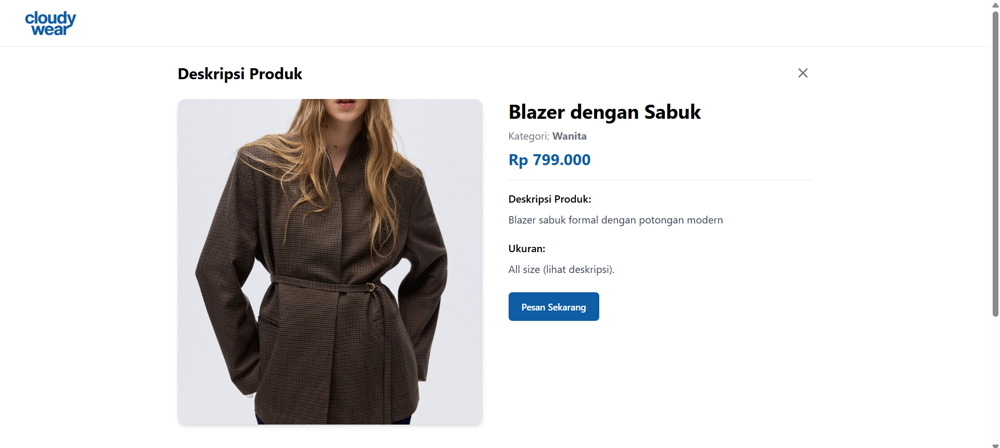
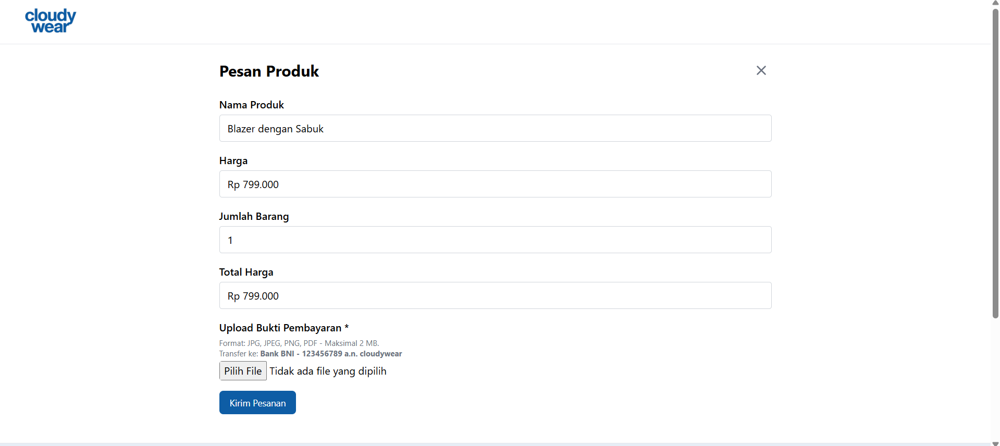

# cloudywear - Platform E-Commerce


cloudywear adalah platform e-commerce berbasis web yang menyediakan berbagai produk fashion dan gaya hidup modern. Dibangun dengan teknologi komputasi awan, cloudywear menghadirkan pengalaman belanja yang cepat, aman, dan dapat diakses kapan pun melalui perangkat apa pun. Pengguna dapat menjelajahi beragam item seperti pakaian, sepatu, tas, topi, dan aksesoris, sekaligus mengikuti tren fashion terbaru dengan mudah.

## Daftar Isi

- [Fitur Utama](#fitur-utama)
- [Tech Stack](#tech-stack)
- [Persyaratan Sistem](#persyaratan-sistem)
- [Instalasi](#instalasi)
- [Konfigurasi](#konfigurasi)
- [Role & Permissions](#role--permissions)
- [Fitur Berdasarkan Role](#fitur-berdasarkan-role)
- [Screenshot](#screenshot)
- [Struktur Database](#struktur-database)
- [Penggunaan](#penggunaan)
- [Deployment](#deployment)
- [Kontribusi](#kontribusi)
- [Lisensi](#lisensi)

## Fitur Utama

###  Manajemen Admin
- ✅ **CRUD Produk** - Admin dapat melihat, menambah, mengubah, dan menghapus produk.
- ✅ **CRUD Kategori** - Admin dapat melihat, mengubah, dan menghapus kategori produk.
- ✅ **RUD Pesanan** - Admin dapat memantau, mengelola, dan menyelesaikan pesanan.
- ✅ **Pencarian** – Memudahkan Admin menemukan produk yang diinginkan.

### Manajemen Produk
- ✅ **Katalog Produk** – Menampilkan seluruh produk cloudyWear.
- ✅ **Detail Produk** – Informasi lengkap seperti nama produk, harga, ukuran, dan deskripsi
- ✅ **Pencarian & Filter** – Memudahkan Pengguna menemukan produk yang diinginkan.

### Manajemen Pemesanan User/Customer
- ✅ **Form Pemesanan (Quick Order)** – Pelanggan mengisi form, setelah submit pesanan otomatis tersimpan.
- ✅ **Popup Konfirmasi** – Pop-up konfirmasi bahwa pesanan akan diproses.
- ✅ **Pencarian** – Memudahkan pengguna/pelanggan menemukan produk yang diinginkan.

### Fitur Modern
- ✅ **Dark Mode** - Tema gelap & terang dengan toggle.
- ✅ **Responsive Design** - Mobile-first UI dengan navigasi hamburger menu yang smooth.
- ✅ **Design Token System** - Color palette modern 2025 untuk konsistensi UI.

## Tech Stack

### Backend
- **Laravel 12.39.0** - Framework aplikasi
- **Laravel Breeze 2.3.8** – Sistem autentikasi dan scaffolding sederhana
- **PHP 8.2.19** - Runtime environment yang digunakan
- **Spatie Laravel Permission 6.7** – Manajemen role & permission (Admin & User)
- **Supabase** - Auth, Database, Storage 

### Frontend
- **Tailwind CSS 3.4.18**
- **Vite 7.1.12**
- **PostCSS 8.5.6**
- **Alpine.js 3.15.1**

### Build Tools
- **Laravel Vite Plugin 2.0.1** 

## Persyaratan Sistem

- PHP >= 8.2.19
- Supabase (Auth, Database, Storage)
- Composer
- Node.js & NPM
- Web Server (Apache/Nginx)
- Extension PHP yang dibutuhkan:
  - OpenSSL
  - PDO
  - Mbstring
  - Tokenizer
  - XML
  - Ctype
  - JSON
  - BCMath
  - GD atau Imagick

## Instalasi

### 1. Clone Repository

```bash
git clone https://github.com/aidilsaputrakirsan-classroom/final-project-cloud-computing-a-cc-kelompok-6-cloudy
cd cloudywear
```

### 2. Install Dependencies

```bash
# Install PHP dependencies
composer install

# Install Node dependencies
npm install
```

### 3. Setup Environment

```bash
# Copy file environment
cp .env.example .env

# Generate application key
php artisan key:generate
```

### 4. Konfigurasi Database

Edit file `.env` dan sesuaikan konfigurasi database:

```env
SUPABASE_URL=
SUPABASE_ANON_KEY=
SUPABASE_SERVICE_ROLE=
SUPABASE_STORAGE_BUCKET=cloudywear
```

### 5. Migrasi Database

```bash
# Jalankan migrasi dan seeder
php artisan migrate --seed

# Atau jika ingin fresh install
php artisan migrate:fresh --seed
```

### 6. Setup Storage

```bash
# Create symbolic link untuk storage
php artisan storage:link
```

### 7. Build Assets

```bash
# Development
npm run dev

# Production
npm run build
```

### 8. Jalankan Aplikasi

```bash
# Development server
php artisan serve
```

Aplikasi akan berjalan di `http://localhost:8000`

## Konfigurasi

### Email Configuration

Edit konfigurasi email di file `.env`:

```env
MAIL_MAILER=log
MAIL_SCHEME=null
MAIL_HOST=127.0.0.1
MAIL_PORT=2525
MAIL_USERNAME=null
MAIL_PASSWORD=null
MAIL_FROM_ADDRESS="hello@example.com"
MAIL_FROM_NAME="${APP_NAME}"
```

### File Storage

Untuk menggunakan AWS S3 storage, konfigurasi:

```env
AWS_ACCESS_KEY_ID=
AWS_SECRET_ACCESS_KEY=
AWS_DEFAULT_REGION=us-east-1
AWS_BUCKET=
AWS_USE_PATH_STYLE_ENDPOINT=false
```

## Role & Permissions

Sistem menggunakan 2 role utama dengan permission berbeda:

| Role | Deskripsi |
|------|-----------|
| **Admin** | Pengelola sistem yang bertanggung jawab terhadap web cloudywear |
| **User/Customer** | Pengguna yang dapat melihat, memilih, dan memesan produk cloudyWear |

## Fitur Berdasarkan Role

### Admin
- 🔐 Login & Logout
- 📊 Dashboard
- 📦 Kelola Produk
- 📚 Kelola Kategori Produk
- 🛍️ Kelola Pesanan User/Customer
- 📑 Activity Log

### User/Customer
- 🔐 Register, Login, & Logout
- 🏷️ Detail Produk
- 📝 Form pemesanan (Quick Order)
- ✔️ Pop-up Konfirmasi Pesanan

## Screenshot

### 1. Halaman Register

*Halaman Register dengan form nama, email, password, dan confirm password*

### 2. Halaman Login

*Halaman login dengan form email dan password*

### 3. Dashboard (Admin)

*Halaman Dashboard Admin dengan ringkasan total produk, pesanan selesai, total pembelian, total pendapatan, warning produk yang memiliki stok rendah, dan tabel transaksi penjualan hari ini yang dapat di filter melalui kalender*

### 4. Manajemen Produk (Admin)

*Halaman pengelolaan produk-produk cloudywear*

### 5. Manajemen Kategori (Admin)

*Halaman pengelolaan kategori untuk produk-produk cloudywear*

### 6. Manajemen Pemesanan (Admin)

*Halaman pengelolaan pemesanan produk yang telah dipesan oleh customer/user*

### 7. Activity Log (Admin)

*Halaman activity login dan Logout user yang dapat dilihat admin*

### 8. Katalog Produk (User/Customer)

*Halaman user/customer dapat melihat seluruh produk cloudywear*

### 9. Deskripsi Produk (User/Customer)

*Halaman user/customer dapat melihat detail deskripsi dari masing-masing produk cloudywear*

### 10. Form Pesan Produk (User/Customer)

*Halaman pemesanan produk dengan form yang perlu hanya menyesuaikan total barang yang akan dibeli dan upload bukti pembayaran*

## Struktur Database

### Tabel Utama

- **users** - Menyimpan data akun pengguna (Admin & User/Customer)
- **categories** - Menyimpan data kategori produk
- **products** - Menyimpan data produk cloudywear
- **orders** - Menyimpan data pesanan pelanggan
- **activity_logs** - Mencatat aktivitas penting Admin & User/Customer

### Relasi Database

```
users (1) ─── (1) admin
users (1) ─── (1) user/customer

users (1) ─── (n) orders
users (1) ─── (n) activity_logs
categories (1) ─── (n) products
products (1) ─── (n) order_items
orders (1) ─── (n) order_items
```

## Arsitektur & Komponen

### Arsitektur Aplikasi

Aplikasi cloudywear dibangun dengan arsitektur berbasis Laravel MVC dan memanfaatkan komponen modern untuk pengalaman interaktif dan manajemen data yang efisien. Berikut rincian komponen utamanya:

- **Controllers (12)** - Menangani logika bisnis dan routing aplikasi.
- **Models (19)** - Eloquent ORM models dengan relasi antar tabel (users, products, categories, orders, dll.).
- **Traits** - Reusable logic untuk mempermudah pengembangan, seperti UpdateDeleteTraits.

### Fitur Teknis Unggulan

- **Interaktivitas Frontend** - Menggunakan Alpine.js untuk elemen interaktif dan real-time UI update.
- **Role-based Access Control (RBAC)** - Mengelola permission dengan Spatie Laravel Permission.
- **Design Token System & Dark Mode** - Konsistensi warna dan tema gelap/terang.
- **Responsive Mobile-First** - Optimasi tampilan untuk semua perangkat.

## Testing

### Test Framework

Aplikasi dilengkapi dengan **PHPUnit 10.0** untuk unit dan feature testing:

```bash
# Jalankan semua tests
php artisan test

# Jalankan dengan coverage
php artisan test --coverage

# Jalankan test spesifik
php artisan test --filter=NamaTest
```

### Konfigurasi Test

- **Test Database**: SQLite in-memory untuk isolasi
- **Test Suites**: Unit tests dan Feature tests
- **Mock Services**: Mail, Queue menggunakan array/sync driver
- **Coverage**: Enabled untuk monitoring code quality

## Penggunaan

### Login Pertama Kali

Setelah instalasi dan seeding database, Anda dapat login dengan akun default yang dibuat oleh `UserSeeder`. Periksa file `/database/seeders/UserSeeder.php` untuk kredensial default.

### Workflow Umum

1. **Admin** login ke platform.
2. **Admin** membuat kategori produk baru.
3. **Admin** menambahkan produk beserta detailnya.
4. **User/Customer** menjelajahi katalog.
5. **User/Customer** register atau login ke platform.
6. **User/Customer** memilih produk yang ingin dibeli.
7. **User/Customer** melihat deskripsi detail produk.
8. **User/Customer** melakukan pemesanan produk melalui form Quick Order.
9. **User/Customer** mendapatkan informasi berupa pop-up bahwa pesananan telah berhasil.
10. **Admin** mengupdate status pesanan (pending, diproses, dikirim, selesai, dibatalkan).
11. **Admin** melakukan manajemen stok dan menyesuaikan katalog sesuai tren.

## Deployment

### Requirements Production

- PHP 8.2 atau lebih tinggi
- Supabase (Auth, Database, Storage)
- Composer
- Node.js & NPM
- Web server dengan SSL certificate

### Production Setup

1. Clone repository ke server
2. Install dependencies
3. Setup environment production
4. Optimize aplikasi:

```bash
# Optimize configuration
php artisan config:cache

# Optimize routes
php artisan route:cache

# Optimize views
php artisan view:cache

# Optimize autoloader
composer install --optimize-autoloader --no-dev
```

5. Setup cron job untuk scheduled tasks:

```bash
* * * * * cd /path-to-your-project && php artisan schedule:run >> /dev/null 2>&1
```

6. Setup queue worker (optional):

```bash
php artisan queue:work --daemon
```

### GitHub Actions

Project ini sudah dilengkapi dengan GitHub Actions untuk auto-deployment. Konfigurasi dapat dilihat di `.github/workflows/deploy.yml`.

## Kontribusi

Kontribusi selalu diterima! Silakan ikuti langkah berikut:

1. Fork repository ini
2. Buat branch fitur baru (`git checkout -b feature/AmazingFeature`)
3. Commit perubahan (`git commit -m 'Add some AmazingFeature'`)
4. Push ke branch (`git push origin feature/AmazingFeature`)
5. Buat Pull Request

### Coding Standards

- Ikuti PSR-12 coding standard
- Gunakan meaningful variable dan function names
- Tambahkan komentar untuk logika yang kompleks
- Write clean dan maintainable code

## Lisensi

Project ini dilisensikan di bawah [MIT License](LICENSE).

## Credits

- **Laravel Framework** - [https://laravel.com](https://laravel.com)
- **Soft UI Dashboard** - [https://www.creative-tim.com](https://www.creative-tim.com)
- **Spatie Laravel Permission** - [https://spatie.be](https://spatie.be)

## Support

Jika ada pertanyaan atau issues, silakan:
- Buat issue di GitHub repository
- Hubungi tim development

---

**Developed with ❤️ for Kelompok A6 cloudy**

*Last updated: Desember 2025*